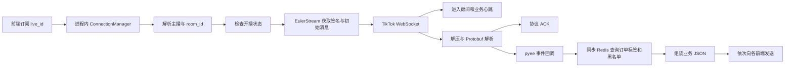
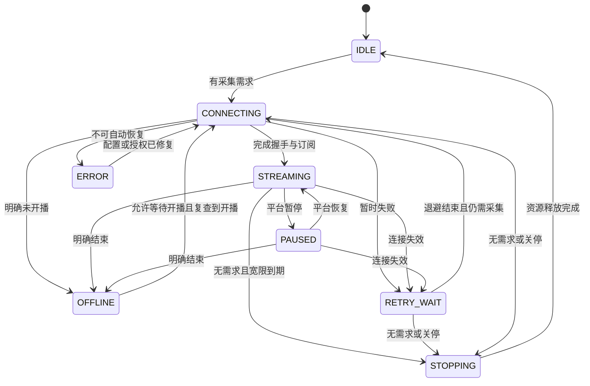
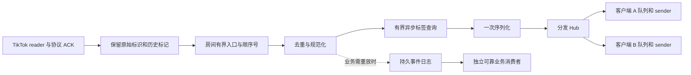

# TikTok 弹幕采集稳定性与流畅度优化方案

> 本文是改造前基线 `1ec66be` 的历史审查，所引源码行号对应该版本。后续已实施代码优化，实际改动、兼容取舍和验证方式见 [服务运行说明](../SERVICE.md)。例如，最终采用非事务 GET pipeline 保留错误语义，并默认保持标签实时查询，没有启用本文建议的 TTL 缓存。

审查日期：2026-09-09。代码基线：`1ec66be`。范围：用户已确认的国际版 TikTok，以及当前 FastAPI 转发服务。

建议继续使用 Python、asyncio 和现有 TikTok 协议实现，优先修复连接生命周期、同步 I/O 和广播拥塞，再把业务服务从示例目录独立出来。当前已有的 `im_enter_room`、业务心跳和签名重试需要保留并补回归验证。

本文区分基线源码事实、离线复现和设计建议。编写此审查时未连接真实直播间、调用签名服务或读取线上日志，也没有测量线上丢失率、真实延迟、容量或部署状态。该审查阶段仅新增方案与诊断脚本；后续代码实施情况以服务运行说明为准。

## 1. 项目定位与目标

### 1.1 我对现有项目的理解

这是一份带本地修复的 TikTokLive SDK，加上面向现有业务的弹幕 WebSocket 网关。核心业务逻辑集中在 312 行的 [fastapi_ws_server.py](/Users/muleng/Workspace/TikTokLive_python/examples/fastapi_ws_server.py:44)，并非单纯的 SDK 示例。

当前完整链路如下：



主要组件的职责和保留价值：

| 组件 | 当前职责 | 优化方向 |
| --- | --- | --- |
| `TikTokLive/client/client.py` | 房间解析、开播检查、启动采集、事件分发 | 保留 SDK 接口，补清理、错误分类与可控事件入口 |
| `TikTokLive/client/ws/` | 握手、解压、ACK、进入房间、心跳 | 保留最近协议修复，增加任务监督和异常清理 |
| `TikTokLive/client/web/` | HTTP 请求与 EulerStream 签名 | 统一超时、重试预算、资源关闭与配置 |
| `examples/fastapi_ws_server.py` | 房间连接复用、前端接入、业务字段、广播 | 拆分为正式服务模块 |
| `examples/redis_helper.py` | Redis 连接与历史业务数据格式兼容 | 异步查询、缓存、数据模型与降级策略 |
| `fastsort-python*.service` | 单实例及蓝绿进程配置 | 配置外置、健康检查、排空与版本追踪 |
| `proto/` 与事件生成脚本 | 协议定义及生成代码 | 控制本地补丁，保存协议样本与生成方式 |

当前做对的部分包括：按直播间共享采集器的设计意图；等待 `start()` 返回的任务；HTML/API 两种房间解析路径；签名请求对部分超时和 5xx 的重试；按需 ACK；`im_enter_room` 与递增序号的 `hb` 心跳。最近几次提交已经修复过“刚连上就关闭”和“只收到第一批弹幕”，重构必须覆盖这两类回归。

`dyMsgId`、`dyRoomId` 等是现有业务兼容字段。内部新模型采用 TikTok 或中性命名，旧接口继续通过适配器输出原字段。

### 1.2 把“丝滑、稳定”拆成可交付目标

1. **连续可用**：短暂断网、签名超时或服务重启后自动恢复，前端状态能反映真实情况。
2. **低尾延迟**：Redis 波动、某个前端变慢时，其他房间和健康前端仍能及时收到弹幕。
3. **消息语义明确**：区分实时消息、历史消息和本服务重放；避免重复展示，涉及订单处理时避免重复执行。
4. **资源有边界**：采集器、后台任务、队列、缓存、连接池均有上限，运行时间变长不会持续积压。
5. **故障可定位**：区分签名慢、上游无数据、解析失败、标签查询慢、发送拥塞和前端渲染慢。

代码含 `orderNumber` 和 `blackLevel`，说明它承担业务标签补充；仓库没有下游订单处理和前端源码。因此建议默认保留消息完整性，只有明确属于纯展示的消费端才能选择跳过过旧消息。标签查询失败表示“未知”，不能据此认定用户不在黑名单。

## 2. 具体问题与优先级

本文的 P0 表示第一批稳定性修复，P1 表示随后完成的可靠性与结构改造，P2 表示测量后实施的扩容及性能优化。

### 2.1 P0：先修这些问题

| 问题 | 代码证据 | 触发与影响 | 修改方案 |
| --- | --- | --- | --- |
| 异步回调里做同步 Redis I/O | [两次 get](/Users/muleng/Workspace/TikTokLive_python/examples/fastapi_ws_server.py:146)、[同步客户端](/Users/muleng/Workspace/TikTokLive_python/examples/redis_helper.py:7) | 每条弹幕查询两次；查询耗时直接占住事件循环，影响所有房间、心跳和前端 ping/pong | `redis.asyncio`、明确超时与连接池上限；单机 Redis 用一次 `MGET`；增加有界缓存 |
| 同房间并发接入可创建多个采集器 | [检查 clients 后 create_task](/Users/muleng/Workspace/TikTokLive_python/examples/fastapi_ws_server.py:221)、[后台才登记 client](/Users/muleng/Workspace/TikTokLive_python/examples/fastapi_ws_server.py:74) | 两次接入都可能看见 client 尚不存在；重复连接、签名额度浪费、重复弹幕，且 tasks 字典只保留最后一个任务 | 在锁内创建并登记唯一 RoomSession 和 supervisor task，使用 session/task 状态判断，而非等待 client 出现 |
| 采集任务结束后没有房间恢复循环 | [一次性 start/await/finally](/Users/muleng/Workspace/TikTokLive_python/examples/fastapi_ws_server.py:172)、[底层禁止复用签名 URL 重连](/Users/muleng/Workspace/TikTokLive_python/TikTokLive/client/ws/ws_connect.py:66) | 前端还连着，采集却已停止；没有新前端加入时也不会再次启动 | 房间 supervisor 根据错误类型重试，每次重连重新获取签名和连接参数 |
| “已连接”状态残留 | [连接时设 True](/Users/muleng/Workspace/TikTokLive_python/examples/fastapi_ws_server.py:78)、[finally 未清状态](/Users/muleng/Workspace/TikTokLive_python/examples/fastapi_ws_server.py:189) | 上游已结束或断开，新前端仍可能先收到 `LIVING`；旧前端也缺少可靠的断开状态 | 用明确状态机替代独立 bool，连接失效时立即转移状态；携带 session generation 防止旧任务改写新状态 |
| 广播受慢客户端牵制 | [逐个 await send_text](/Users/muleng/Workspace/TikTokLive_python/examples/fastapi_ws_server.py:271) | 一个 socket 发送等待会延迟同轮后续客户端；回调积压后内存和延迟一起上升 | 每个客户端有界发送队列和唯一 sender；广播只投递，发送超时或落后超预算只处理对应客户端 |
| 取消路径可能跳过清理 | [等待已取消的采集任务](/Users/muleng/Workspace/TikTokLive_python/TikTokLive/client/client.py:241)、[外层仅捕获 Exception](/Users/muleng/Workspace/TikTokLive_python/examples/fastapi_ws_server.py:191) | `CancelledError` 不属于 `Exception`；可在关闭 HTTP、清字典之前再次退出 | 所有清理进入 `finally`；受控等待任务，释放资源后再传播取消；清理函数必须可重复调用 |
| 签名 HTTP 客户端没有关闭路径 | [签名器创建独立 AsyncClient](/Users/muleng/Workspace/TikTokLive_python/TikTokLive/client/web/web_signer.py:85)、[close 只关主客户端和 curl](/Users/muleng/Workspace/TikTokLive_python/TikTokLive/client/web/web_base.py:126) | 房间反复创建销毁时，签名连接池资源不能被明确及时释放 | 增加 `TikTokSigner.aclose()`，纳入 SDK 生命周期；明确共享池与私有池的所有权 |

`AsyncIOEventEmitter` 会把异步回调调度为独立任务。因此当前程序同时存在“回调里的同步操作阻塞整个循环”和“异步发送等待期间继续积累回调任务”两种问题；仅把 Redis 改成 `await` 无法解决后一种问题。[pyee 官方行为说明](https://pyee.readthedocs.io/en/latest/api/)

### 2.2 P1：可靠性与业务正确性

| 问题 | 代码证据 | 建议 |
| --- | --- | --- |
| 心跳任务异常未被持续监督；异常退出可能绕过尾部清理 | [connect 清理位于循环之后](/Users/muleng/Workspace/TikTokLive_python/TikTokLive/client/ws/ws_client.py:255)、[心跳只处理取消](/Users/muleng/Workspace/TikTokLive_python/TikTokLive/client/ws/ws_client.py:340) | reader、heartbeat、watchdog 受同一会话管理；心跳失败通知 supervisor；异常、正常结束、取消都经过 finally |
| 接入、状态通知、弹幕、pong 可同时写一个前端 socket | [on_open](/Users/muleng/Workspace/TikTokLive_python/examples/fastapi_ws_server.py:87)、[初始状态](/Users/muleng/Workspace/TikTokLive_python/examples/fastapi_ws_server.py:232)、[pong](/Users/muleng/Workspace/TikTokLive_python/examples/fastapi_ws_server.py:297) | 所有输出都经过唯一 sender；连接状态和消息的先后由显式序号确定 |
| 最后一个前端离开就关闭上游 | [remove](/Users/muleng/Workspace/TikTokLive_python/examples/fastapi_ws_server.py:247) | 增加可取消的 30 秒空闲宽限期，减少刷新和移动网络切换引发的重复签名；持续采集业务用独立订阅租约 |
| 没有稳定去重与重放协议 | [每条生成 uuid4](/Users/muleng/Workspace/TikTokLive_python/examples/fastapi_ws_server.py:135)、[协议含历史标记](/Users/muleng/Workspace/TikTokLive_python/TikTokLive/proto/tiktok_proto.py:17221) | 保留平台 message ID 和 `is_history`，增加稳定 event ID、会话内序号及有界重放；不要把每次随机 msgId 当幂等键 |
| Redis 失败会缺业务字段；createdUsers 类型不一致 | [异常前后字段赋值](/Users/muleng/Workspace/TikTokLive_python/examples/fastapi_ws_server.py:146) | 先构造完整默认结构；明确 `metadataStatus`；内部统一列表，旧接口按契约适配 |
| Redis 兼容解析不完整 | [Optional 未设默认值](/Users/muleng/Workspace/TikTokLive_python/examples/redis_helper.py:10)、[仅接受特定嵌套列表](/Users/muleng/Workspace/TikTokLive_python/examples/redis_helper.py:42) | 容许缺省的字段显式 `= None`；普通列表、Java 包装列表、双重 JSON 分别建样本测试；错误日志不打印完整用户数据 |
| 下播错误被宽泛异常吞掉 | [parse_room_id 的 except Exception](/Users/muleng/Workspace/TikTokLive_python/TikTokLive/client/web/routes/fetch_room_id_live_html.py:83) | JSON/结构错误与下播分开；保留原始异常分类；HTML/API fallback 只由一层负责，避免重复请求 |
| 恢复直播的自定义事件分支写错 | [两次判断 PAUSED](/Users/muleng/Workspace/TikTokLive_python/TikTokLive/client/client.py:436) | 第二个分支改为 UNPAUSED 并验证；当前服务直接监听 ControlEvent，不能据此断言它所有恢复通知都失效 |
| 429 重试时间解析脆弱 | [直接 int RateLimit-Remaining](/Users/muleng/Workspace/TikTokLive_python/TikTokLive/client/errors.py:200) | 核实供应商实际响应头语义；优先正确解析 Retry-After/明确的 reset 时间，缺失和非法值回退；不能直接假设额度数量等于等待秒数 |
| 日志掩盖诊断信息且有同步写盘成本 | [SDK 强制 ERROR](/Users/muleng/Workspace/TikTokLive_python/TikTokLive/client/client.py:76)、[文件日志配置](/Users/muleng/Workspace/TikTokLive_python/examples/log_config.py:19) | 统一日志级别和 handler，避免传播导致重复记录；关键故障用结构化字段；原始消息限时采样 |
| 没有服务级生命周期与就绪管理 | [app 初始化](/Users/muleng/Workspace/TikTokLive_python/examples/fastapi_ws_server.py:41) | 用 lifespan 管理 manager、Redis、池和关停；增加服务及房间健康指标 |

Pydantic 2 的 `Optional[T]` 表示允许 `None`，并不自动意味着字段可以省略。[Pydantic 2 迁移说明](https://docs.pydantic.dev/2.0/migration/)

此外，三个 systemd 文件包含硬编码签名凭证，[redis_helper.py](/Users/muleng/Workspace/TikTokLive_python/examples/redis_helper.py:7) 包含硬编码 Redis 凭证，签名请求还配置了 [verify=False](/Users/muleng/Workspace/TikTokLive_python/TikTokLive/client/web/web_signer.py:85)。应在配置改造时轮换已入库凭证、改用受限 EnvironmentFile 或秘密管理，并恢复证书验证；具体部署信任链需验证。本文不复制凭证值。

### 2.3 已完成的离线验证

使用 Python 3.12.1，从当前源码抽取类定义，以模拟客户端、Redis 和 WebSocket 执行真实控制流程。这样无需安装第三方包，也不会导入服务触发日志初始化或访问真实凭证。

[诊断脚本](/Users/muleng/Workspace/TikTokLive_python/plans/tiktok-live-review-probes.py)

```bash
python3.12 /Users/muleng/Workspace/TikTokLive_python/plans/tiktok-live-review-probes.py
```

| 场景 | 本次结果 | 能证明什么 |
| --- | --- | --- |
| 同一事件循环中两个前端同时加入同房间 | 创建 2 个采集器，只登记 1 个任务 | 连接复用存在竞态 |
| 采集正常结束，但前端仍保持连接 | `live_connected=True`；无重启任务；新前端先收到 `LIVING` | 状态残留及自动恢复缺失 |
| 第一个模拟客户端发送等待 120ms | 后续健康客户端约 121ms 才收到 | 同轮串行广播存在队头阻塞 |
| 两条消息并发广播至一个客户端 | 同一 socket 有 2 个并发 sender 调用 | 当前没有单写入者约束；不等于已证明实际网络必然乱序 |
| 两次同步 Redis GET 各等待 50ms | 5ms 定时器额外延迟约 103ms | 同步 Redis 可阻塞事件循环；数值为注入延迟，不是线上基准 |
| Redis 抛出异常 | 缺少 orderNumber、blackLevel、createdUsers | 降级消息结构不完整 |
| SDK 关闭时采集任务已被取消 | 再次抛 CancelledError，未到 HTTP close | 取消清理存在缺口 |
| 正常调用 HTTP 客户端 close | 仅主 HTTP client 被关闭 | 签名 client 未纳入关闭 |
| 页面明确包含 status=4 | 转成解析失败而非保留下播异常 | 下播分类被吞掉 |

诊断断言全部通过意味着这些缺陷被复现，不表示服务通过稳定性验收。脚本是当前基线的审查材料；实现修复时需把对应期望改成正式回归测试。

## 3. 结构优化：正式服务与协议 SDK 分离

### 3.1 第一阶段采用模块化单体

保留一个部署单元和现有 SDK，先让所有生命周期和数据边界清晰，避免在尚未测量容量前引入跨服务故障。

建议目录（以下是待实施设计，不是已创建目录）：

```text
TikTokLive/                    # 保留 SDK；协议修复尽量小且可追踪
live_service/
  app.py                       # FastAPI 创建与 lifespan
  config.py                    # 类型化配置、合法性检查
  api/
    websocket.py               # 接入、鉴权、订阅和断开
    health.py                  # livez、readyz、内部状态
  rooms/
    session.py                 # RoomSession、generation、状态
    supervisor.py              # 启动、失败恢复、idle grace、停止
    registry.py                # 标准化房间 key，唯一创建
  ingestion/
    tiktok_adapter.py          # SDK 接入，提取统一事件
    pipeline.py                # 有界入口、顺序、去重
    health.py                  # 上游帧及心跳健康观测
  enrichment/
    redis_store.py             # 异步查询、连接池、超时
    cache.py                   # 容量与 TTL、更新失效
    legacy_models.py           # 历史 Redis 格式适配
  delivery/
    hub.py                     # 本地分发与客户端管理
    subscriber.py              # 有界队列、唯一 sender、超时
    replay.py                  # 按部署阶段实现重放
    legacy_protocol.py         # 旧字符串与 dy 字段兼容
  models/events.py             # Comment、Status、Gap 等模型
  observability.py             # 指标、日志、阶段耗时
tests/
  unit/
  integration/
  fixtures/                    # 脱敏协议帧及 Redis 样本
  load/
deploy/systemd/
plans/
```

第一步迁移后，让 [旧入口](/Users/muleng/Workspace/TikTokLive_python/examples/fastapi_ws_server.py:292) 暂时只导入新 app，维持 systemd 和现有前端的接入路径。验证完成后再更新启动命令。

### 3.2 明确组件所有权

- **应用**拥有 Redis 池、全局签名并发限制和 RoomRegistry。
- **RoomSession**拥有一个 supervisor，以及当前 generation 的 SDK client、reader、heartbeat、入口队列和去重窗口。
- **Subscriber**拥有一个前端 socket、发送队列和 sender task。
- **SDK**负责协议收发；业务标签、订单字段、前端 JSON 不进入 SDK。
- **业务订阅**与**前端连接**分开计数；需要持续收单或审计时，前端暂时离线不会关闭采集。

RoomSession 替代当前多份容易不一致的字典。关键字段包括 `canonical_key`、`room_id`、`generation`、`state`、`supervisor_task`、`client`、`subscribers`、`last_frame_at`、`last_comment_at`、`last_heartbeat_sent_at`、`retry_attempt` 和 `last_error_code`。

接入时在锁内标准化主播标识、获取或创建 session，并登记唯一 supervisor；网络操作在锁外进行。`@name` 和 `name` 应归一；完整 URL 必须按允许的平台域名解析，主播标识与本次直播 room_id 分开保存。旧任务只有在 generation 仍匹配时才能修改 session 或发布状态。

## 4. 连接、心跳与自动恢复

### 4.1 显式状态机



任何活动状态都必须能响应应用关停；图中仅列出主要转移。前端 socket 健康与上游直播状态分开显示。无评论不等于连接失效，首次 fetch 返回历史弹幕也不等于后续持续推送已验证。

### 4.2 重连由房间 supervisor 负责

每轮按“解析/校验房间 → 获取新签名 → 创建新连接 → 发送进入房间 → 运行 reader 与 heartbeat → 清理 → 分类后重试”执行。签名 URL 不长期缓存、不在重试中反复复用。源码注释提到其短有效期，具体有效期仍应按供应商响应与实测确认。

| 失败类型 | 处理策略 |
| --- | --- |
| 明确断网、连接重置、暂时性 5xx、读/连接超时 | 重新建立会话，指数退避加随机抖动 |
| 签名 429 | 按供应商响应等待，使用 key 级并发/速率限制，防止所有房间同时重试 |
| 401/403、配置缺失或不可恢复拒绝 | 标记可诊断的错误，停止高频重试，配置修复后恢复 |
| 明确下播 | OFFLINE；有“等待开播”需求时低频复查，避免不停调用签名接口 |
| 普通评论解析失败 | 隔离单条、采样并计数；控制帧或持续批量解析失败升级为会话故障 |
| 主动关闭/应用关停 | 清理并传播取消，不进入重连循环 |

退避初值建议 `delay = random.uniform(0, min(30, 1 * 2**attempt))` 秒；额度限制的等待优先于此公式。稳定运行一段时间后再清零 attempt，避免“刚连上就断”不断回到最快重试。

现有签名默认是 20 秒超时、最多额外重试 2 次，加线性等待 1 秒、2 秒；在每次都读超时的场景，仅这一步就可能等待约 63 秒。HTTPX 的读超时是等待数据块的时间，不能当作全流程截止时间。因此保留分阶段超时，同时在 supervisor 增加总连接预算，限制内外两层重试的合计成本。[现有重试](/Users/muleng/Workspace/TikTokLive_python/TikTokLive/client/web/routes/fetch_signed_websocket.py:78)、[HTTPX 超时定义](https://www.python-httpx.org/advanced/timeouts/)

开播中的 room_id 可以短期缓存，重连时使用并校验；遇到房间失效、明确下播或新一轮直播时失效缓存。不要为节约一次请求永久跳过开播判断，也不要为了恢复一个房间阻塞其他房间的签名请求。

### 4.3 心跳保留协议语义，增加健康判断

现有 SDK 明确关闭了标准 WebSocket ping/pong，并使用 TikTok 业务 `hb`。保持现有 `im_enter_room`、序号心跳与 ACK 机制，不直接套用浏览器连接的 ping_timeout 参数。

业务心跳与标准 WebSocket Ping/Pong 是不同机制，应分别管理。[websockets 官方说明](https://websockets.readthedocs.io/en/stable/topics/keepalive.html)

新增三个观察点：

1. **传输健康**：最近收到任意上游帧的时间，包含非评论帧；在解析或过滤前记录。
2. **心跳任务健康**：任务是否还活着、最近成功发送时间、发送是否超时。发送成功仅证明写入完成，不能等同于服务端已确认。
3. **业务活跃度**：最近评论/其他事件时间，仅用于诊断和展示。

对可实测确定有周期流量的房间，设置多周期无帧阈值；对安静房间，先标记可疑、限频检查开播和连接状态，再决定重连。只有协议确实提供可验证响应时，才能把响应缺失作为硬性超时依据。不能用“30 秒没弹幕”一律断开。

将心跳和 reader 纳入同一故障域：其中任一异常结束，supervisor 停止同代任务、关闭连接并进入分类恢复。非消息帧按类型处理，避免把任意 hb/控制载荷都强行解析成消息列表。

### 4.4 关闭顺序

先停止新采集/重试与新订阅，再关闭上游、结束 reader/heartbeat，然后限时排空已接收的业务队列、结束 sender，最后关闭 SDK 主 HTTP、签名 HTTP、curl 和应用 Redis 池。异常关闭应有整体时间上限与明确未排空计数。

客户端创建、事件注册也要放在受管理的异常范围内；当前构造发生在 `_run_client` 的 try 之前。避免任务等待自身，也避免取消异常使 registry 清理被跳过。只抑制预期取消，不使用 `suppress(BaseException)` 隐藏所有错误。[Python 取消与清理语义](https://docs.python.org/3.12/library/asyncio-task.html)

应用启动/关停采用 FastAPI lifespan 统一管理。[FastAPI 官方建议](https://fastapi.tiangolo.com/advanced/events/)

## 5. 消息通路：隔离阻塞、控制积压、保持顺序

### 5.1 目标链路



ACK 必须按上游协议及时发送，不等待 Redis 标签或所有前端确认。上游 ACK、本服务持久化确认、前端应用确认是三个边界，不能混为一谈。当前 ACK 在交付事件之前，进程在 ACK 后崩溃仍有未持久化窗口，不能声称端到端绝对不丢。

### 5.2 从源头限制回调并发

短期把 CommentEvent listener 改成**同步且极短的入口函数**，只提取必要上下文并 `put_nowait`；一个房间由有限数量消费者处理。不要继续让每条异步 listener 都等待 Redis 和广播。

需要保留外层 `msg_id`、`is_history`、接收时间时，在 SDK/adapter 中提供明确的事件上下文接口，避免依赖未定义的动态字段。长期可提供受控的异步事件迭代接口，但要定义其阻塞和 ACK 关系。

仅增加 `await queue.put()` 到原异步 listener 仍可能积累无限等待任务。队列必须有消息数、字节数和最老消息年龄三类限制，QueueFull 的策略要显式化：

| 消费用途 | 过载处理 |
| --- | --- |
| 关键评论/订单输入 | 有界缓冲并及时持久化；达到承载极限时明确降级、告警和拒绝新负载，不能悄悄丢弃 |
| 纯展示弹幕 | 可合并发送；若选择跳过过旧消息，报告跳过数量和游标间隙 |
| 点赞、在线人数等统计 | 允许聚合为最新快照，保留控制事件优先级 |
| 已落后前端 | 只关闭或降级该前端，返回可重连游标；其他客户端继续 |

有限内存、无限持续输入和任意长下游故障无法同时满足不阻塞且不丢失。方案通过容量预算、持久化、背压和显式间隙处理这个边界。

### 5.3 Redis 查询与业务补充

应用只创建一个受管理的异步 Redis 池，设置 `socket_connect_timeout`、`socket_timeout` 和 `max_connections`。单节点当前两个 GET 可改一次 MGET，或在多个事件间小批量 pipeline；如果后续用 Cluster，先处理跨 slot 限制，不能直接照搬 MGET。

`redis.asyncio` 提供协程命令和异步池关闭，pipeline 需要显式执行。[redis-py 官方用法](https://redis.readthedocs.io/en/stable/examples/asyncio_examples.html)

缓存设计建议：订单标签初始 TTL 3–10 秒，黑名单初始 TTL 1–3 秒，加短负缓存、容量上限和同 key 查询合并。写端可发送失效通知，TTL 作为通知丢失时的补偿。以上时间是待压测与业务校准的初值；收单判定需要的时效不能只靠展示缓存。

标签总体等待预算先设为 30–50ms，超时后原始弹幕继续走通路，标签用已有可信缓存或标记 `unknown`。如果黑名单用于下单阻断，业务消费者等校验结果，不把“unknown”变成允许执行。需要异步补充标签时，用带 event ID 与版本的 metadata update，避免晚到更新覆盖新状态。

保持房间接收顺序：初期一个房间一个批处理消费者；遇到热点房间再用有界并发 enrichment，加有限大小的重排窗口及每条截止时间。不能直接启动任意数量协程后按完成顺序推送。

### 5.4 前端广播

每个前端一个 sender，状态、评论、业务 pong 都从此处发出。Hub 不 await 每个客户端的网络发送，只把已序列化消息投到各队列。队列满或发送超时，关闭对应客户端，记录原因及最后游标。

每客户端队列是独立缓冲的常见做法；这里还要显式限制容量。FastAPI 使用 Starlette WebSocket，不应直接替换成只接受底层 websockets 对象的广播函数。[websockets 广播与客户端队列说明](https://websockets.readthedocs.io/en/16.1/topics/broadcast.html)

批量发送建议等待不超过 10–20ms，最多 20 条，优先测量再启用；繁忙时减少帧数，空闲时不强制等待整批。该变化需协议版本协商，旧前端默认仍收到一条一帧。

前端接入时先将当前状态快照排入其队列，再允许新会话事件进入，避免先 `LIVING` 后 `CONNECTING` 的竞争。send 完成表示服务端完成发送动作，不证明浏览器已收到或页面已渲染。

### 5.5 去重、补发与身份

建议内部事件契约：

```json
{
  "schemaVersion": 2,
  "type": "comment",
  "platform": "tiktok",
  "roomId": "7300000000000000001",
  "streamerId": "creator_handle",
  "eventId": "tiktok:7300000000000000001:comment:7400000000000000001",
  "sourceMessageId": "7400000000000000001",
  "deliveryEpoch": "session-generation-uuid",
  "seq": 123,
  "sourceCreatedAt": null,
  "receivedAt": "2026-09-09T10:00:00.000Z",
  "isHistory": false,
  "userId": "7500000000000000001",
  "uniqueId": "viewer_handle",
  "nickname": "观众昵称",
  "content": "示例弹幕",
  "metadataStatus": "ok",
  "metadata": {"orderNumber": "", "blackLevel": 0, "createdUsers": []}
}
```

上述字段是建议协议。实际提取路径和时间单位必须由当前 Protobuf 与脱敏样本验证；不支持的来源时间保留 null。所有平台大整数 ID 以字符串输出，规避前端精度问题。

event ID 采用平台、room_id、消息类型、有效的来源 message ID。缺失或为 0 时生成一次本服务 ID，并标记去重能力有限，不能把所有 0 ID 合并。不要用“相同用户+相同内容”删除用户真实重复发言。

进程内去重用 TTL+容量上限的缓存，覆盖同次直播的上游重连；重启或多实例需要共享/持久去重，或在业务存储中建立 event ID 唯一约束。先完成可恢复的接收记录，再将其标记为已处理，避免“先去重成功、后持久化失败”造成消息永远被跳过。

保留 `is_history`。展示可显示历史，自动订单消费者默认不执行历史回放，除非业务有明确可校验的补处理规则。序号只保证本服务接收顺序，不宣称等于平台全局顺序。

单实例第一版重放使用按房间、按时间和容量受限的 ring buffer，例如 60 秒或 5000 条取先到者。客户端携带 `(deliveryEpoch, seq)` 恢复，切换到实时流时保证补发与新事件无遗漏、无重复。epoch 已失效或游标过旧则返回 `gap`，不假装补齐。内存重放无法覆盖进程重启或蓝绿切换。

若业务要求进程重启后仍可补发，将规范化事件写入 Redis Streams 或已有持久日志；处理成功后再确认，业务写入保持幂等。持久化配置、保留策略、重试和磁盘容量共同决定恢复能力，单独加入 Streams 并不自动保证绝对不丢。[Redis 投递语义说明](https://redis.io/docs/latest/develop/pubsub/)

### 5.6 前端协作要求

仓库未包含前端，以下属于接口联调任务：

- 展示“服务连接”和“直播采集”两个状态，签名重试有错误原因和下一次尝试时间。
- 应用层心跳和有限退避重连；携带游标恢复，按稳定 event ID 去重。
- 评论列表采用有限长度、虚拟列表或批量渲染，控制每帧 UI 更新量。
- 历史/补发弹幕有标记；超过渲染预算时按产品约定处理，并显示同步状态。
- 对需要测端到端延迟的客户端加入少量抽样接收确认；页面渲染完成指标需前端额外上报。

浏览器 WebSocket API 不暴露原生 Ping/Pong，需要应用层保活配合。[websockets 浏览器保活说明](https://websockets.readthedocs.io/en/stable/topics/keepalive.html)

## 6. 协议解析与依赖管理

### 6.1 先减少确定的无用工作

目前即使只消费 CommentEvent 和 ControlEvent，SDK 仍构造通用 response event，并尝试解析其他已知类型，[入口在这里](/Users/muleng/Workspace/TikTokLive_python/TikTokLive/client/client.py:380)。可提供“服务所需事件白名单”模式，仅解码订阅事件与必须处理的控制事件。ACK 和连接状态不能被事件过滤跳过，SDK 默认行为维持兼容。

通用 raw event 只在有人订阅或诊断采样时创建，避免对每条消息执行 `to_dict → from_dict`。读取 [event.user](/Users/muleng/Workspace/TikTokLive_python/TikTokLive/events/proto_events.py:1214) 时先存到局部变量；若底层 user 不是 ExtendedUser，重复访问可能重复构造对象。完整用户 JSON 和 base64 只限时采样，关闭 DEBUG 时也避免提前构造昂贵日志字符串。

解压与 Protobuf 解析要记录耗时，限制压缩帧和解压结果大小，普通坏消息应隔离。CPU 数据确认后，再评估 orjson、uvloop、分房间进程或解析 worker；不要先改消息编码、关闭 gzip 或重写语言。

### 6.2 固定可复现运行环境

- SDK `pyproject.toml` 与服务 `requirements.txt` 分工明确，服务用正式 dependency extra 或独立项目配置，统一锁定传递依赖。
- 显式管理 `websockets` 与 `websockets_proxy` 的兼容组合；当前直接使用 legacy API，不能只升级某一包。
- 保留本地 fork 版本和基线提交，记录 `im_enter_room`、heartbeat 等补丁，升级上游前执行样本回放与持续事件检查。
- 服务运行时选定一个经依赖验证的 Python 3.11/3.12 小版本并固定；SDK 若继续宣称支持 3.10，不能无兼容处理就加入仅 3.11 提供的 API。
- [install_env.sh](/Users/muleng/Workspace/TikTokLive_python/install_env.sh:28) 当前只安装 SDK，而 FastAPI/Redis/Uvicorn 在另一依赖文件；补齐一条可复现的服务安装命令。
- [.gitignore](/Users/muleng/Workspace/TikTokLive_python/.gitignore:13) 的 `headers.py.venv/` 疑似两条规则拼接，应拆分并排除 `.venv/`、日志和临时构建产物。
- 当前大量 HTML 文档及生成文件应与业务改动分开管理；21,740 行协议生成文件不作为日常人工重构对象。

本机默认 `python3` 为 3.8.10，不符合项目声明；本次离线诊断明确使用 3.12.1。当前检查的 3.12 环境也未安装完整服务依赖，所以未把源码探针包装成“服务启动成功”。上线验证要使用实际发布环境和锁定依赖。

## 7. 部署、容量与可观测性

### 7.1 单实例先稳定，再扩展

当前 manager 只在进程内共享。直接加 `uvicorn --workers 4`，或同时把同一房间路由给蓝绿实例，会为该房间建立多套采集和签名请求。是否在线上已发生，需要部署信息确认。

第一阶段维持每个房间一个明确 owner，完成健康检查与排空。需要水平扩展时，再拆成 Collector 与 WebSocket Gateway：采集器按房间分片，网关按客户端连接扩展。

分布式所有权采用带到期时间、续租和 owner token 的房间租约，发布端使用 fencing generation 验证；旧 owner 在失去租约后停止发布和重连。只有一个 Redis 锁并不能彻底避免网络分区下的双采集，仍需要事件去重和过期 owner 拒绝机制。

实时网关可从 Pub/Sub 接收通知，但需要重放时以持久日志为准。Redis Pub/Sub 为至多一次投递，离线订阅方会丢失消息。[Redis 官方投递说明](https://redis.io/docs/latest/develop/pubsub/)

多个网关都要收到同一条弹幕时，不能让它们在一个 Streams consumer group 里竞争消费后就当作广播；可以独立读取游标或独立 group，并设置清理与保留策略。订单处理组与展示网关消费也应分开。

### 7.2 蓝绿发布具体流程

1. 新版本启动并完成配置、Redis 和协议回放自检，报告 release SHA 与协议补丁版本。
2. 老版本停止接受新订阅；新连接逐步切到新版本。
3. Collector 有租约时按房间交接；旧连接完成有界排空后关闭。
4. 前端重连并携带游标；跨版本补发依赖共享日志，只有内存缓冲时明确返回 gap。
5. 观察连接成功率、重连频率、标签降级、发送延迟及重复处理；异常则回滚路由与制品。

目前三个 service 文件只是启动配置，仓库未提供完整流量切换和排空逻辑。实施前应核对真实反向代理的 WebSocket upgrade、空闲超时和关停宽限，设置为与应用心跳及排空预算一致。避免退出时整个房间同时无节制重新签名。

### 7.3 配置建议初值

以下均为灰度起点，不是实测最优值，也不是对上游的承诺。

| 参数 | 起点 | 调整依据 |
| --- | --- | --- |
| 前端断开后的采集保留期 | 30 秒 | 用户刷新频率与签名额度 |
| 房间重新连接退避 | 1 秒基数，上限 30 秒，随机抖动 | 按错误类型覆盖，429 使用供应商等待 |
| 单次完整连接预算 | 30–45 秒 | 房间解析、签名与握手耗时拆分后调整 |
| 全局签名并发 | 2–4 | 实际账户额度与响应延迟 |
| 标签查询总等待预算 | 30–50ms | Redis 部署位置、业务允许的新鲜度 |
| 房间入口队列 | 1000 条，另设字节与年龄上限 | 峰值消息速率 × 可承受缓冲时间 |
| 每客户端队列 | 200–500 条，另设字节与年龄上限 | 客户端峰值速率与最大延迟 |
| 单次前端发送超时 | 2 秒 | 网络质量；只影响该客户端 |
| 可选微批 | 最多 20 条，等待不超过 20ms | 控制附加延迟，需 v2 客户端 |
| 内存重放保留 | 60 秒或 5000 条，先到者为限 | 消息体大小、房间数量 |

容量预算应基于实测消息大小：

`总内存 ≈ SDK/连接开销 + 各房间入口及重放缓冲 + 各客户端队列 + 去重/标签缓存 + 网络写缓冲`

例如不能只设置“5000 条重放”却不限制每条大小和房间总数。新建房间数、每租户订阅数、单 IP 接入频率及最大帧大小也应有配额，避免异常调用耗尽签名额度。WebSocket 接口在 accept 前完成实际的认证/授权和 Origin 校验；CORS 配置不能代替这些检查。

### 7.4 必须能回答的运行问题

| 运行问题 | 指标或日志 |
| --- | --- |
| 为什么连接慢？ | resolve、live check、sign、handshake 各阶段耗时；总连接耗时 |
| 为什么连着却没新数据？ | room state、last upstream frame age、last comment age、heartbeat task 状态 |
| 为什么弹幕越看越慢？ | ingress/subscriber queue 深度、字节数、最老消息年龄 |
| Redis 是否拖累服务？ | 请求耗时、超时数、缓存命中、降级比例、池等待 |
| 有没有越来越多的泄漏？ | 活跃/停止中 session、后台 task、HTTP/WS 连接、FD、RSS |
| 是否重复处理？ | source event 去重次数、重放条数、业务幂等冲突计数 |
| 协议是否变化？ | parse_error、unknown message type、解压错误、样本版本 |
| 是否实际恢复？ | 重连成功率、失败分类、恢复耗时、重试次数 |

日志包含 release、instance、room、generation、event ID 和 error code；指标标签保留受控维度，不把用户 ID、消息 ID 放进 Prometheus 标签。精确房间诊断可使用受限内部状态接口，避免无限标签基数。

`/livez` 检查进程存活；`/readyz` 检查是否具备接入条件和必需依赖。单房间故障或展示标签降级不应自动触发整个进程反复重启；可靠业务日志不可用时则按该服务模式明确降级或停止接入。

## 8. 验收标准与实施顺序

### 8.1 建议性能目标

所有目标都在约定容量、健康上游和健康客户端前提下验收；异常场景另测隔离与恢复。先记录基线，再冻结硬件、网络和数据集进行前后比较。

| 指标 | 第一版候选目标 | 测量口径 |
| --- | --- | --- |
| 本服务处理与发送延迟 | p95 < 100ms，p99 < 250ms | 收到上游帧到健康客户端 send 完成；不含平台生成延迟和浏览器渲染 |
| 事件循环调度延迟 | p99 < 20ms | monotonic 定时探针的额外延迟 |
| 健康依赖下建立采集 | p95 < 8 秒 | 从订阅需求产生到握手与订阅完成 |
| 已检测故障后的恢复 | 上游恢复可用时 p95 < 45 秒；短暂断线争取 < 15 秒 | 包含剩余退避与重新订阅；与 30 秒退避上限一致，单独报告故障检测耗时 |
| 同房间采集唯一性 | 单实例始终 1 个有效 owner | 100 个并发接入、离开/重进交错 |
| 已知测试数据的服务内丢失/重复 | 正常负载为 0，注入过载有可解释 gap | 比较源 fixture ID 与客户端/业务消费记录 |
| 资源回收 | 重复启停后任务/FD 回基线容差 | 1000 次房间生命周期；长期 RSS 无持续上升趋势 |

跨机器端到端延迟要校时，平台时间戳先验证单位；同进程阶段耗时使用 monotonic。真实上游有无推送完整消息不能靠本服务计数证明，测试“源”应是受控发布或可追踪的回放数据。

### 8.2 回归与故障注入清单

| 场景 | 必须满足 |
| --- | --- |
| 首批 fetch 后继续推送多批实时评论 | 持续收到新消息；进入房间只按会话正确发送；心跳序号及 ACK 正确 |
| 两个或 100 个前端同时加入同房间 | 单实例仅创建一个采集器；全部收到一致状态 |
| 最后离开与新接入交错 | 不误关新会话、不残留旧任务；grace 内无需重新签名 |
| Redis 延迟 50/200/1000ms、连接失败、非法 JSON | 其他房间/心跳不被阻塞；消息结构稳定；业务权限结果显式未知 |
| 一个客户端限速或完全不读 | 其他客户端延迟保持预算；慢客户端在界限内被处理 |
| 签名 429/5xx、DNS/连接/读超时 | 分类、退避、全局并发限制和重试总预算生效 |
| 连接 reset、半开连接、心跳任务异常 | 状态真实、故障被检测、重新签名恢复；安静房间不会误判 |
| 下播、暂停、恢复、中止控制事件 | 状态语义正确；不无止境重连已结束房间 |
| 坏 Protobuf、未知非消息帧、异常压缩 | 不让一条普通坏消息拖垮服务，保留诊断样本与计数 |
| 重复初始消息、相同内容但不同 message ID | 前者去重，后者保留；历史不触发重复业务执行 |
| 客户端恢复游标、过旧游标、跨 epoch | 正确补发或明确 gap；补发转实时没有竞态 |
| 进程 SIGTERM、部署交接、SDK 任务取消 | 有界关停，所有归属资源关闭，无旧 generation 写入 |

负载梯度可从单房间 50 条/秒、5 客户端，扩到 10 房间 × 100 条/秒、每房间 20 客户端，再测试 30 秒的 5 倍突发。它们是测试输入，不是当前容量承诺。真实消息大小、点赞/礼物比例、解压开销和前端网络模型必须与目标业务接近。

每个梯度先运行 30 分钟；最终候选执行至少 24 小时持续测试，重要直播场景可延长到 72 小时。正常负载、Redis 故障和慢客户端都要测尾延迟，而非只看平均吞吐。

### 8.3 分批实施

以下为一名熟悉 Python asyncio 的工程师的粗略工程量，不含外部账号、前端排期或供应商故障等待；完成时间以验收门槛为准。

| 批次 | 工作 | 粗估 | 完成门槛 |
| --- | --- | --- | --- |
| A：建立基线 | 固定当前运行环境、补本方案故障的正式回归、记录关键阶段指标 | 1–2 天 | 重现现有问题，得到可重复基线 |
| B：稳定性修复 | 唯一 RoomSession、状态机、重新签名重连、取消与签名池关闭、心跳监督 | 3–5 天 | 并发接入/断网/取消/下播用例通过，旧协议不变 |
| C：流畅度改造 | 异步 Redis、有界入口、缓存、完整降级模型、独立 sender | 3–5 天 | Redis 故障和慢客户端不拖累健康通路，队列/任务不无限增长 |
| D：工程化上线 | 从 examples 提取服务、lifespan、配置外置、依赖锁、健康检查、日志指标、灰度与回滚 | 2–4 天 | 可复现安装和发布，24 小时测试通过 |
| E：消息恢复与前端联调 | 稳定 ID、history 语义、v2 契约、游标补发、客户端渲染 | 3–5 天及联调 | 重复/断线重放/跨 epoch 语义可验证 |
| F：按需求扩展 | 持久业务日志、Collector/Gateway 分离、租约/fencing、跨版本交接 | 依据实际容量和可靠性要求另估 | 多实例失效切换、幂等与恢复通过 |

稳定 ID 和历史语义应在 C 的内部模型里预留，E 才公开新协议。若弹幕已经驱动不可重复的订单动作，稳定 ID、持久输入和业务幂等必须前移到首次生产改造，不等到普通扩容阶段。

回滚策略：每批独立发布；首次保持 `/ws/{live_id}` 和旧字段格式；新 sender、缓存、重连参数使用可回退配置。v2 通过新路径或协商启用，不能把旧字符串协议一夜替换为 JSON。数据结构变更先兼容读写，回滚不要求删除已有日志或修改历史消息。

**建议的实际启动顺序是 A → B → C → D。** 这四批直接针对已验证的“连而无数据、慢时一起慢、刷新反复重签、运行越久资源越难管”等风险；扩容、协议升级和前端性能工作根据测量结果继续推进。
